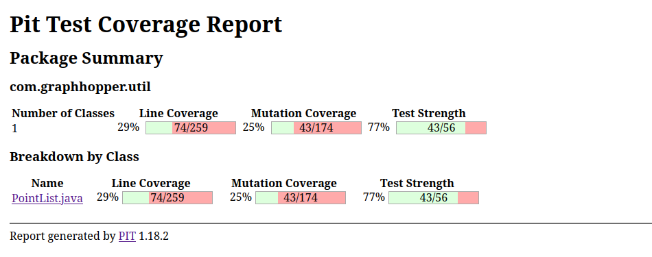
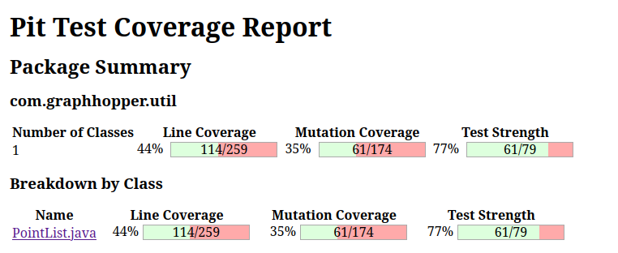
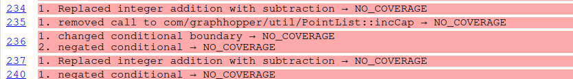
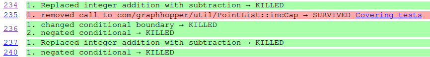
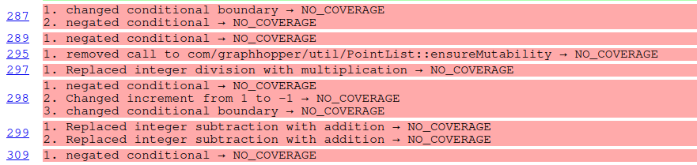
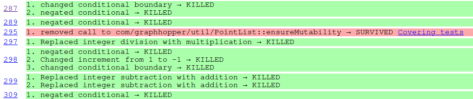
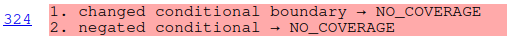
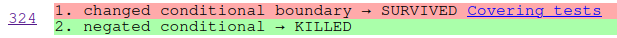
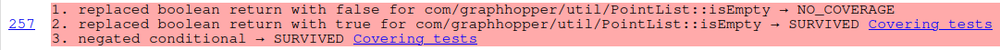
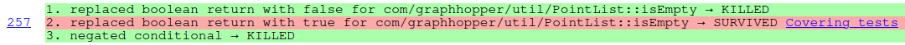

# Rapport Tâche 2
- Jonathan Beaulieu
- Joaquim Sandler-Soussy

## Classe choisie
Nous avons choisi de tester la classe [PointList.java](../../../../../main/java/com/graphhopper/util/PointList.java) dans le module web-api. Les tests sont dans [PointListTest.java](./PointListTest.java)

## Tests effectuées
### [`testSetElevation()`](./PointListTest.java)
Ce test a pour objectif de vérifier que la méthode `setElevation()` changement correctement la valeur à l'index mentionné.
Pour ce faire, nous avons initialisée une liste et on y a ajouté 5 éléments. Ensuite, nous avons changé la valeur d'un des points et vérifié que la valeur a bien été modifié avec l'oracle.

### [`testSetElevation_withIndexOutOfBound()`](./PointListTest.java)
Ce test vérifie qu'une exception de type `ArrayIndexOutOfBoundException` est levée si la méthode `setElevation()` est appelée avec un index supérieur au nombre d'éléments.

Nous avons initialisée une liste de 5 éléments, puis tenté de changer l'élévation du point à l'index 5 pour assurer qu'il n'y a pas de "off by one errors".

### [`testSetElevationIn2DPointList()`](./PointListTest.java)
Ce test s'assure qu'une exception de type `IllegaleStateException` est levée si la liste à laquelle on souhaite ajuster l'élévation est en 2D.

Pour cela, nous avons créé une liste de 10 éléments avec le paramètre `is3D` à `false`. Ensuite nous utilisons un oracle pour vérifier que l'erreur est lancé si la méthode est appelée sur un point (à un index valide).

### [`testClearList()`](./PointListTest.java)
Ce test a comme objectif de s'assurer qu'une liste est vidée après l'appel de la méthode `clearList()`.

Nous avons instancié une liste et ajoutés 10 éléments. Puis, nous avons assurer que la liste est bien de taille 10 avant d'appeler la méthode testé. Puis un oracle vérifique que la liste est vide.

### [`testTrimeToSize()`](./PointListTest.java)
Ce test vise à s'assurer qu'un objet PointList est bien réduit à la taille indiqué lorsque la méthode `trimToSize()` est appelée.

Nous avons instancié une liste ajouté 10 points et appelé la méthode sous test pour la réduire à trois. Par la suite, nous avons vérifié que la taille a bien été changée.

### [`testTrimToSize_LargerThanOldSize()`](./PointListTest.java)
Ce test vérifie que le cas limite où on tente de tailler la liste une taille plus grande que l'originale.

Nous créons une liste, puis appelons la méthode sous test en s'attendant à ce qu'une exception de type `IllegalArgumentException` soit levée.

### [`reverse3DPointList()`](./PointListTest.java)
Ce test vérifie que les éléments d'un objet PointList sont bien inversés lors de l'appel à `reverse()`.

Pour cela, nous créons d'abord un objet PointList et nous y ajoutons 10 éléments avec des valeurs de départ égale à l'index pour la latitude, la longitude et l'élévation, afin de pouvoir facilement comparer les résultats. Nous appelons ensuite la méthode sous test, puis nous comparons les valeurs pour s'assurer qu'elles sont tous inversé correctement.

## Analyse de mutation avec PiTest
### Rapport avant changements

### Rapport après ajout des tests

### Mutants trouvés
Le nombre de mutants trouvés a passé de 43 à 61, soit 18 nouveaux mutants éliminés.

5 Mutants ont été trouvés par les appels de la méthode `add()` dans le test `testAddPointListJavaFaker()`
+ 234: Le mutant est trouvé en vérifiant que la taille de la liste et bien celle attendue.
+ 236
    + 1: Changer la taille de la boucle "for" revient à mettre moins que le nombre de point attendu ce qui est trouvé lors de la vérification de chaque point de la liste.
    + 2: Inverser le conditionnel cause également un changement dans le nombre de variable ajouté dans la liste.
+ 237: Changer l'addition par une soustraction cause les mauvaises valeurs à être ajouté (ou même un ArrayOutOfBoundException)
+ 240: La négation inversée à cette ligne prévenait d'ajouter les valeurs pour l'élévation dans la liste.

---

Les tests sur la méthode `setElevation()` ont trouvés 3 Mutants (lignes 287 et 289) et ceux sur `reverse()` en ont trouvé 7 (Lignes 297-299 et 309)

+ 287
    + 1: Le cas est trouvé en attendant une exception, mais elle n'est pas retourné à l'éxécution dans `testSetElevation_withOutOfBound()`
    + 2: La négation cause la levée de l'exception lorsqu'elle n'était pas attendue.
+ 289: La négation retourne une exception non attendue par le test.
+ 297: Changer pour une multiplication affecte l'index des valeurs changé dans le tableau. Cela cause soit une `ArrayOutOfBoundException` ou que les valeurs soient mal placées dans le tableau. Dans les deux cas, les assertions avec les valeurs attendu previenne le mutant de passer.
+ 298
    + 1,2,3: Les trois mutants sur cette ligne affectent tous le comportement de la boucle for et sont détectés de la même façon que la ligne 297.
+ 299
    + 1,2: Idem que 297 et 298. l'indice pour chager les valeurs du tableau est altéré et détecté.
+ 309: L'inversion de la valeur ici prévient les valeurs d'élévation d'être changé dans le tableau. Cela est détecté lors de l'assertion des valeurs de l'élévation dans le test.

---
`trimToSize()` a trouvé 1 mutant (Ligne 324)
+ 324: L'inversion de la valeur booléenne permet à la méthode de continuer lorsque le test s'attendait à une exception alors il échoue.

---

`clear()` a trouvé 2 mutants (Ligne 257)
+ 257
    + 1: Changer la valeur de retoure par `false`, mais le test attendait `true`.
    + 2: Inverser la condition dans ce cas cause le même résultat que 257.1.

## Java-Faker
### [`testAddPointListJavaFaker()`](./PointListTest.java)
- Le test "testAddPointListJavaFaker" se veut simple et évite au maximum les dépendances 
externes pour maximiser l'encapsulation. Nous utlisons faker.number().
- Nous créons d'abord une `PointList` source avec une capacité initiale de 3 points 3D et 3 tableaux
"lats", "lons" et "eles" qui nous servent de reference pour les assertions.
- En utilisant JavaFaker, nous génèrons ensuite 3 points avec precision de 6 décimales pour la latitude et la longitude et 
2 décimales pour l'élévation, dans les intervalles indiquées dans chaque test respectivement, et nous 
ajoutons les lon, lat et ele dans leur tableau.  
- On teste ensuite la fonction add(PointList) en ajoutant la liste source dans une nouvelle liste 
cible. 
- On utilise pour finir assertEquals pour comparer les lat, lon et ele de la liste cible avec les 
tableaux contenant les lat, lon et ele de base.
- Les tableaux lats, lons, eles garantissent que les assertions se basent sur les valeurs d’entrée 
originales, pas l’implémentation de PointList.

